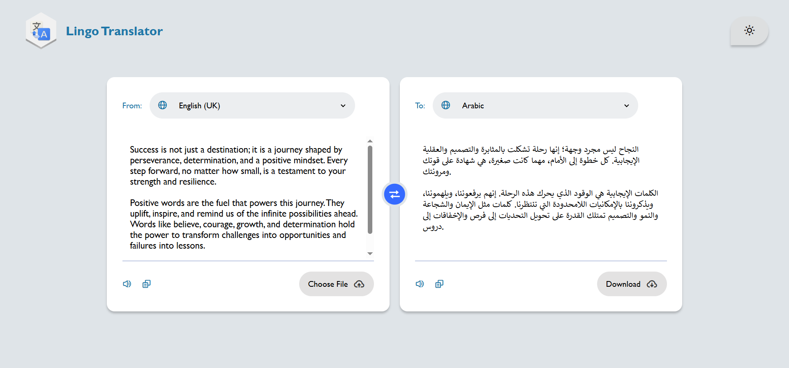
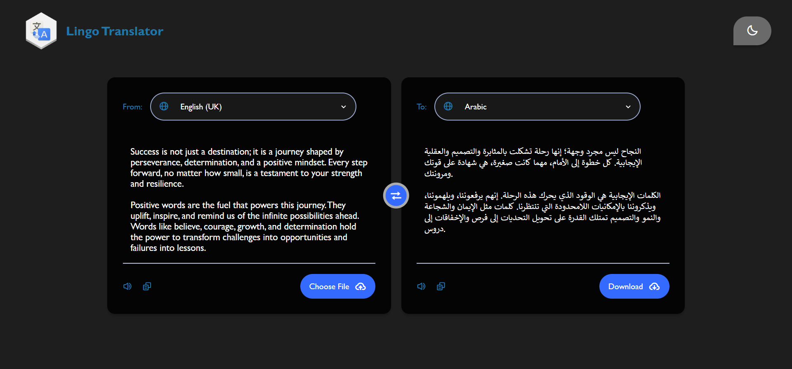

# Lingo Translator

Lingo Translator is a simple and user-friendly web application for translating text between multiple languages in real time. It supports features like text-to-speech, file upload for translation, file download, and a dark mode toggle for better usability.

## Features

- Real-Time Translation: Translate text between various languages using the Google Translate API.

- Text-to-Speech: Listen to the input or translated text.

- File Upload and Translation: Upload .txt files for instant translation.

- File Download: Save the translated text as a .txt file.

- Dark Mode Toggle: Switch between light and dark modes for better readability.

- Language Swapping: Easily swap the input and output languages with a single click.

## Technologies Used

- HTML5
- CSS3
- JavaScript (ES6)
- Google Translate API: For accurate and real-time translations.
- SweetAlert2: For elegant and customizable alert messages.
- Boxicons: For modern icons used in the UI.

## preview

## demo
https://naglaa99.github.io/lingo-translator/